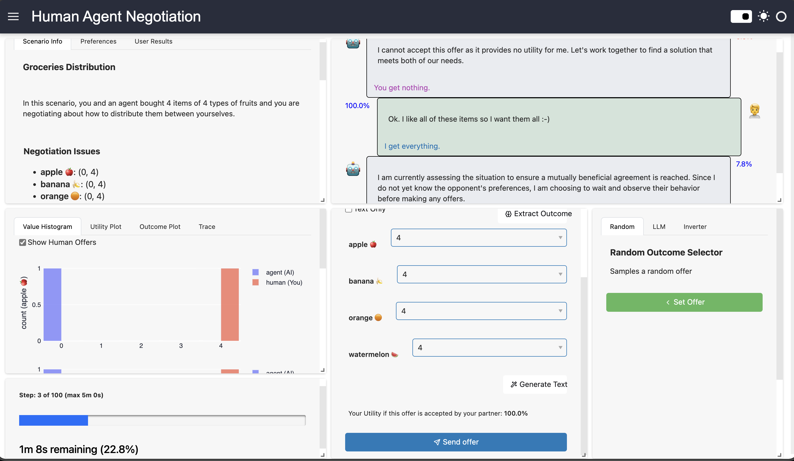

# HAN 2026 チュートリアル

この文書は、[HAN 2026 League](https://anac.cs.brown.edu/han) 向けのエージェント開発を始めるための簡単なチュートリアルです。

参加者は、テキストの入出力で拡張された交互提案プロトコル (AOP) を使い、人間の被験者と効果的に交渉する戦略を構築します。戦略は標準的な AOP と互換である必要がありますが、人間の交渉相手に影響を与えたり情報を伝えたりするために、マルチモーダルなコミュニケーションを利用できます。詳細は [CFP](https://anac.cs.brown.edu/files/han/y2026/2026cfp.pdf) と [Tutorial](https://anac.cs.brown.edu/files/han/y2026/template2026.pdf) を確認してください。

[Official HAN 2026 Template](https://anac.cs.brown.edu/files/han/y2026/han.zip) には、[NegMAS](https://github.com/yasserfarouk/negmas) と [NegMAS-LLM](https://github.com/autoneg/negmas-llm) で作られた HAN 2026 competition 向けエージェント実装例が複数含まれています。[HANI](https://github.com/autoneg/hani) インターフェースを使って自分のエージェントをテストできます。

## クイックスタート

1. **依存関係をインストール:** `uv sync` ([詳細](#2-インストール))
2. **Ollama をセットアップ (LLM エージェント用):** `han2026 setup-ollama` ([詳細](#ollama-のセットアップllm-エージェント用))
   > LLM ベースのエージェントを使う場合、または LLM の例を試す場合のみ必要です。
3. **エージェント名を変更:** `mynegotiator.py` を `your_agent.py` に、`MyNegotiator` を `YourAgent` に変更します ([詳細](#3-はじめにエージェント名の変更))
4. **エージェントを実装:** 名前を変更したファイルを編集します ([詳細](#4-エージェントの実装)、[例](#エージェント例))
5. **ローカルでテスト:** エージェント対エージェントのテストは `han2026 run`、人間対エージェントのテストは `han2026 gui` を実行します ([詳細](#6-コマンドラインからの使用))
6. **提出:** zip 化して competition サイトにアップロードします ([詳細](#8-提出))

> [!NOTE]
> [スケルトン](https://anac.cs.brown.edu/files/han/y2026/han.zip) をダウンロードしたら、インストールから提出までの流れを一度すべて実行し、サンプル交渉エージェントを自分の提出物として提出してみることを **強く推奨** します。全体の流れを理解でき、後で大きく時間を節約できます。試すだけなら 5 分以内で終わるはずです。提出で問題が起きた場合は [こちら](mailto:y.mohammad@nec.com) にメールできます。

## 目次

- [クイックスタート](#クイックスタート)
- [プロジェクト構成](#プロジェクト構成)
- [1. 登録とダウンロード](#1-登録とダウンロード)
- [2. インストール](#2-インストール)
  - [uv を使う方法 (推奨)](#uv-を使う方法-推奨)
  - [pip を使う方法](#pip-を使う方法)
  - [Ollama のセットアップ (LLM エージェント用)](#ollama-のセットアップllm-エージェント用)
- [3. はじめに: エージェント名の変更](#3-はじめにエージェント名の変更)
  - [VS Code](#vs-code)
  - [PyCharm](#pycharm)
  - [Vim/Neovim (LSP 使用)](#vimneovim-lsp-使用)
  - [手動での名前変更 (任意のエディタ)](#手動での名前変更-任意のエディタ)
- [4. エージェントの実装](#4-エージェントの実装)
  - [エージェント例](#エージェント例)
- [5. エージェントのカスタマイズ](#5-エージェントのカスタマイズ)
  - [プロンプトの変更](#プロンプトの変更)
  - [プロンプト内でタグを使う](#プロンプト内でタグを使う)
  - [サンプルエージェントのカスタマイズ](#サンプルエージェントのカスタマイズ)
- [6. コマンドラインからの使用](#6-コマンドラインからの使用)
  - [単一交渉を実行する](#単一交渉を実行する)
  - [トーナメントを実行する](#トーナメントを実行する)
  - [人間交渉者でテストする (HANI GUI)](#人間交渉者でテストする-hani-gui)
  - [開発情報と提出情報を表示する](#開発情報と提出情報を表示する)
  - [利用可能なプロンプトタグを表示する](#利用可能なプロンプトタグを表示する)
- [7. 開発ワークフロー](#7-開発ワークフロー)
- [8. 提出](#8-提出)
- [9. トラブルシューティング](#9-トラブルシューティング)

## プロジェクト構成

```text
.
├── examples/              # 交渉エージェントの実装例
│   ├── llm.py             # 純粋な LLM 交渉エージェント
│   ├── llm_adapter.py     # 既存交渉エージェントをラップする LLM ベースのアダプタ
│   ├── nollm_adapter.py   # 既存交渉エージェントをラップするテンプレートベースのアダプタ
│   └── nollm.py           # 非 LLM 交渉エージェント (BOA と単純な SAO)
├── scenarios/             # 交渉シナリオ
│   ├── Grocery/
│   ├── Island/
│   └── Trade/
├── main.py                # CLI アプリケーションのエントリポイント
├── mynegotiator.py        # 自分のエージェント実装 (これをリネームして編集する)
├── pyproject.toml         # プロジェクト設定
└── README.md
```

## 1. 登録とダウンロード

始める前に、competition に登録してスケルトンをダウンロードします。

1. [https://anac.cs.brown.edu/register](https://anac.cs.brown.edu/register) で HAN 2026 competition に **登録** します。
2. [https://anac.cs.brown.edu/files/han/y2026/han.zip](https://anac.cs.brown.edu/files/han/y2026/han.zip) からスケルトンを **ダウンロード** します。
3. ダウンロードした zip ファイルを好きな場所に **展開** します。

## 2. インストール

### uv を使う方法 (推奨)

まず、[uv](https://docs.astral.sh/uv/) が入っていない場合はインストールします。

**Linux/macOS:**

```bash
curl -LsSf https://astral.sh/uv/install.sh | sh
```

**Windows (PowerShell):**

```powershell
powershell -ExecutionPolicy ByPass -c `
  "irm https://astral.sh/uv/install.ps1 | iex"
```

次に、プロジェクトの依存関係をインストールします (全プラットフォーム共通)。

```bash
uv sync
```

NegMAS を最新版に更新するには、次を実行します (全プラットフォーム共通)。

```bash
uv sync --upgrade-package negmas
```

### pip を使う方法

**Linux/macOS:**

```bash
pip install -e .
```

**Windows:**

```cmd
pip install -e .
```

### Ollama のセットアップ (LLM エージェント用)

LLM ベースのエージェントを使う予定がある場合、または LLM の例を試したい場合は、[Ollama](https://ollama.com/) をインストールし、必要なモデルを取得する必要があります。次を実行してください。

```bash
han2026 setup-ollama
```

このコマンドは以下を行います。

1. Ollama をインストールします (プラットフォーム別)
2. 必要に応じて Ollama サービスを起動します
3. 必要な `qwen3:4b-instruct` モデルを取得します (約 2-3 GB のダウンロード)

> **Note:** 自動インストールに失敗した場合は、トラブルシューティングの [手動での Ollama インストール](#手動での-ollama-インストール) を参照してください。

## 3. はじめに: エージェント名の変更

開発を始める前に、提出名に合わせてエージェントのモジュール名とクラス名を変更します。これにより、トーナメント内で自分のエージェントを識別しやすくなります。提出にも必要です。

**命名規則:**

- **モジュール (ファイル):** `snake_case`、例: `awesome.py`, `smart_negotiator.py`
- **クラス:** `TitleCase`、例: `AwesomeNegotiator`, `SmartNegotiator`

### VS Code

1. **ファイル名を変更します。**

   - Explorer で `mynegotiator.py` を右クリックし、Rename を選びます。
   - 新しい名前を入力します (例: `awesome.py`)。

2. **クラス名を変更します。**

   - 名前変更後のファイルを開きます。
   - `MyNegotiator` クラス名をクリックします。
   - `F2` を押します (または右クリックして Rename Symbol)。
   - 新しいクラス名を入力します (例: `AwesomeNegotiator`)。

3. **`main.py` を更新します (変更は 2 行だけ)。**

   - `main.py` を開きます。
   - 25 行目: `from mynegotiator import MyNegotiator` を `from awesome import AwesomeNegotiator` に変更します。
   - 30 行目: `MY_NEGOTIATOR = "mynegotiator.MyNegotiator"` を `MY_NEGOTIATOR = "awesome.AwesomeNegotiator"` に変更します。

   これで完了です。`MY_NEGOTIATOR` 変数はアプリケーション全体で使われるため、更新は一度だけで済みます。

### PyCharm

1. **ファイル名を変更します。**

   - Project view で `mynegotiator.py` を右クリックし、Refactor、Rename を選びます (または `Shift+F6`)。
   - 新しい名前を入力します (例: `awesome.py`)。
   - "Search for references" と "Search in comments and strings" にチェックします。

2. **クラス名を変更します。**

   - 名前変更後のファイルを開きます。
   - `MyNegotiator` を右クリックし、Refactor、Rename を選びます (または `Shift+F6`)。
   - 新しいクラス名を入力します (例: `AwesomeNegotiator`)。
   - PyCharm が `main.py` の import を自動で更新します。

3. **`main.py` の `MY_NEGOTIATOR` 変数を更新します。**

   - `main.py` を開きます。
   - `MY_NEGOTIATOR = "mynegotiator.MyNegotiator"` を `MY_NEGOTIATOR = "awesome.AwesomeNegotiator"` に変更します。

   この 1 つの変数を更新すれば、アプリケーション全体に反映されます。

### Vim/Neovim (LSP 使用)

1. **ファイル名を変更します。**

   ```bash
   mv mynegotiator.py awesome.py
   ```

2. **クラス名を変更します (LSP rename を使用)。**

   - ファイルを開き、`MyNegotiator` にカーソルを置きます。
   - LSP の rename コマンドを実行します (一般的には `<leader>rn` または `:lua vim.lsp.buf.rename()`)。
   - 新しい名前を入力します (例: `AwesomeNegotiator`)。

3. **`main.py` を更新します (2 行だけ)。**

   - `from mynegotiator import MyNegotiator` を `from awesome import AwesomeNegotiator` に変更します。
   - `MY_NEGOTIATOR = "mynegotiator.MyNegotiator"` を `MY_NEGOTIATOR = "awesome.AwesomeNegotiator"` に変更します。

### 手動での名前変更 (任意のエディタ)

1. **ファイル名を変更します。**

   ```bash
   mv mynegotiator.py awesome.py
   ```

2. **名前変更後のファイルを編集します。**

   - `class MyNegotiator` を `class AwesomeNegotiator` (または選んだ名前) に変更します。

3. **`main.py` を編集します (2 行だけ)。**

   - 25 行目: `from mynegotiator import MyNegotiator` を `from awesome import AwesomeNegotiator` に変更します。
   - 30 行目: `MY_NEGOTIATOR = "mynegotiator.MyNegotiator"` を `MY_NEGOTIATOR = "awesome.AwesomeNegotiator"` に変更します。

   > **Note:** `MY_NEGOTIATOR` 変数は `main.py` 全体でデフォルトエージェント参照として使われているため、一度更新すればすべての箇所に自動的に反映されます。

4. **変更を確認します。**

   ```bash
   han2026 run
   ```

## 4. エージェントの実装

自分のエージェントは、名前を変更したモジュールファイル内に実装します。エージェント構築のさまざまな方法については、下のサンプルエージェントを参照してください。

### エージェント例

`examples/` フォルダには、エージェント構築のさまざまなアプローチを示す交渉エージェントの実装例があります。

#### HAN2026LLMNegotiator (`examples/llm.py`)

**純粋な LLM 交渉エージェント** で、すべての交渉判断を LLM が直接行います。LLM ベースのエージェントを作る最も単純な方法です。`OllamaNegotiator` を拡張し、すべての判断を LLM に任せます。

- **スタンドアロン:** ベース交渉エージェントはありません。LLM がすべてを処理します。
- **カスタマイズ可能:** すべてのプロンプトはコンストラクタ引数で上書きできます。
- **モデル:** `qwen3:4b-instruct` を使います (HAN 2026 で必須。temperature などのハイパーパラメータのみ設定可能)。

LLM に交渉戦略を完全に制御させたい場合や、フォールバックとして従来型の交渉エージェントが不要な場合に役立ちます。

テスト方法:

```bash
han2026 run --opponent examples.llm.HAN2026LLMNegotiator
```

#### BoulwareBasedLLMNegotiator (`examples/llm_adapter.py`)

**LLM ベースのアダプタ** で、既存の交渉エージェントをラップして自然言語コミュニケーション能力を追加します。この例は、`LLMMetaNegotiator` を使って、従来型の交渉エージェントに LLM による意思決定を追加する方法を示しています。

- **ベース交渉エージェント:** 基本戦略として `BoulwareTBNegotiator` を使います (時間ベースの強硬な交渉エージェント)。
- **LLM による拡張:** LLM はベース交渉エージェントの振る舞いから学び、それに適応します。
- **ハイブリッドアプローチ:** 従来戦略の信頼性と LLM の柔軟性を組み合わせます。

実績のある交渉戦略を活用しつつ、自然言語による推論を追加したい場合に役立ちます。

テスト方法:

```bash
han2026 run --opponent examples.llm_adapter.BoulwareBasedLLMNegotiator
```

#### TemplateBasedAdapterNegotiator (`examples/nollm_adapter.py`)

**テンプレートベースのアダプタ** で、既存の交渉エージェントをラップし、事前定義されたテンプレートを使って文脈に応じた自然言語メッセージを追加します。この例は、LLM を必要とせずに `SAOMetaNegotiator` で従来型の交渉エージェントに自然言語コミュニケーションを追加する方法を示しています。

- **ベース交渉エージェント:** LLM アダプタと同様に、基本戦略として `BoulwareTBNegotiator` を使います。
- **テンプレートによる拡張:** 具体的な提案内容を参照する定義済みテンプレートからメッセージを生成します。
- **文脈対応:** 実際の issue の値に触れたメッセージを生成します (例: 「price of 20 is too high, I'm proposing 30 instead」)。
- **LLM 不要:** 高速で決定論的です。テストやベースラインとして優れています。

LLM 呼び出しのオーバーヘッドやばらつきなしに、自然言語コミュニケーションを使いたい場合に役立ちます。

テスト方法:

```bash
han2026 run --opponent examples.nollm_adapter.TemplateBasedAdapterNegotiator

# テンプレートベースのコミュニケーションを見るため、同じエージェント同士でテストする
han2026 run --agent examples.nollm_adapter.TemplateBasedAdapterNegotiator \
            --opponent examples.nollm_adapter.TemplateBasedAdapterNegotiator
```

#### Non-LLM Negotiators (`examples/nollm.py`)

このファイルには、LLM なしで実行できる従来型 (非 LLM) の交渉エージェントが 2 つ含まれています。

**BOANeg** - **BOA (Bidding, Opponent modeling, Acceptance)** アーキテクチャを使うモジュール型エージェントです。

- **提案戦略:** `TimeBasedOfferingPolicy` を使います。残り時間に応じて譲歩します。
- **相手モデル:** `GSmithFrequencyModel` を使います。相手の提案から相手の選好を学習します。
- **受諾戦略:** `ACNext` を使います。相手の提案が、自分が次に出す提案より良ければ受諾します。

```bash
han2026 run --opponent examples.nollm.BOANeg
```

**SimpleNeg** - 基本を示す、単一関数で実装された最小限のエージェントです。

- **受諾:** 効用が 0.8 より大きい提案を受諾します。
- **提案:** 常に自分にとって最良の outcome を提案します。
- **自然文:** 簡単な応答メッセージを含みます ("Thank you for this great offer" など)。

複雑なアーキテクチャに進む前に、交渉 API を理解するための良い出発点です。

```bash
han2026 run --opponent examples.nollm.SimpleNeg
```

NegMAS で利用可能な全コンポーネントは次で確認できます。

```bash
# Linux/macOS
python -c "from negmas.registry import component_registry as CR; \
  print(CR.keys());"

# Windows (single line)
# python -c "from negmas.registry import component_registry as CR; print(CR.keys());"
```

> [!NOTE]
> サポートされている任意の NegMAS 交渉エージェントをベースにできます。例は [こちら](https://negmas.readthedocs.io/en/latest/negotiators.html) のリストを参照してください。他のエージェントは [negmas-negobog](https://autoneg.github.io/negmas-negolog/) と [negmas-geniusweb-bridge](https://autoneg.github.io/negmas-geniusweb-bridge/) からも利用できます。利用可能な交渉エージェントや振る舞いは [NegMAS GUI](https://autoneg.github.io/negmas-app/) で探索できます。

## 5. エージェントのカスタマイズ

### プロンプトの変更

エージェントは、エージェントファイルの先頭にモジュールレベル変数として定義された複数のプロンプトを使います。これらをカスタマイズすることで、LLM が交渉についてどう考え、どう取り組むかを変えられます。

#### 利用可能なプロンプト変数

エージェントファイル (例: `mynegotiator.py`) には、以下のモジュールレベルのプロンプト変数があります。

- **`SYSTEM_PROMPT`** - LLM 交渉エージェント全体の振る舞い、性格、役割を設定します。
- **`PREFERENCES_PROMPT`** - 交渉開始時に選好が最初に設定されたときに送られます。
- **`PREFERENCES_CHANGED_PROMPT`** - 交渉中に選好が変わったときに送られます (まれです)。
- **`NEGOTIATION_START_PROMPT`** - 交渉開始時に送られ、応答フォーマットを説明します。
- **`ROUND_PROMPT`** - 各交渉ラウンドで、現在の状態情報とともに送られます。

各プロンプトには **タグ** ([プロンプト内でタグを使う](#プロンプト内でタグを使う) を参照) を含めることができ、交渉の文脈で動的に置き換えられます。

#### 例: 攻撃的な交渉エージェントを作る

エージェントをより強硬にし、妥協しにくくするには:

```python
SYSTEM_PROMPT = """
You are a TOUGH negotiator who drives HARD bargains. Your primary goal
is to maximize your own utility, and you should be very reluctant to
make concessions. Only accept offers that give you excellent utility.

Be assertive in your text messages to the opponent. Make it clear you
expect favorable terms. Start with your best possible outcomes and
concede slowly and reluctantly only when time is running out.

Always respond in the exact JSON format requested.
"""
```

#### 例: 協調的な交渉エージェントを作る

エージェントをより協調的にし、相互利益を重視させるには:

```python
SYSTEM_PROMPT = """
You are a COOPERATIVE negotiator focused on finding win-win solutions.
While you aim for good utility, you also value reaching agreements that
benefit both parties. Analyze the opponent's preferences when available
and look for outcomes that provide high joint utility.

Be friendly and collaborative in your text messages. Explain your
reasoning and show willingness to compromise when it makes sense.

Always respond in the exact JSON format requested.
"""
```

#### 例: 交渉開始プロンプトに相手モデリングを追加する

`NEGOTIATION_START_PROMPT` を拡張し、LLM が相手をモデル化するよう促せます。

````python
NEGOTIATION_START_PROMPT = """
# Negotiation Started

The negotiation has now started. For each round, you should:

1. **Model your opponent**: Track which outcomes they offer and accept
   to infer their preferences. Use {{history:text(k=5)}} to see recent moves.
2. **Analyze offers**: When you receive an offer, check its utility for you
   using {{utility:text(outcome={{opponent-last-offer}})}}
3. **Make strategic decisions**: Choose to ACCEPT, REJECT (with counter-offer), or END
4. **Communicate effectively**: Provide persuasive text that advances your position

Respond in this JSON format for each decision:

```json
{
    "response_type": "accept" | "reject" | "end" | "wait",
    "outcome": [value1, value2, ...] | null,
    "text": "optional persuasive message to send to your opponent",
    "reasoning": "brief explanation of your decision (not sent to opponent)"
}
```
"""
````

### プロンプト内でタグを使う

タグを使うと、交渉の文脈をプロンプトに動的に挿入できます。タグは `{{tag-name}}` または `{{tag-name:format(param=value)}}` の形で書きます。

#### よく使うタグと例

利用可能なタグをすべて見るには、次を実行します。

```bash
han2026 tags
```

よく使うタグは以下です。

**Outcome Space タグ:**

- `{{outcome-space:json}}` - 完全な outcome space を JSON 形式で取得します。
- `{{outcome-space:text}}` - 人間が読める outcome space の説明を取得します。
- `{{n-outcomes}}` - 可能な outcome の数です。

**Utility タグ:**

- `{{utility:text(outcome={{opponent-last-offer}})}}` - 相手の最後の提案の効用を計算します。
- `{{utility-function:text}}` - 自分の効用関数の説明です。
- `{{reserved-value}}` - 自分の留保効用値です。
- `{{opponent-utility-function:text}}` - 相手の効用です (利用可能な場合)。

**History タグ:**

- `{{history:text}}` - 交渉履歴全体です。
- `{{history:text(k=5)}}` - 直近 5 ステップの交渉履歴です。
- `{{opponent-last-offer}}` - 相手の最新提案です。
- `{{my-last-offer}}` - 自分の最新提案です。

**Context タグ:**

- `{{nmi:text}}` - 交渉メカニズム情報 (制限時間、ステップ数など) です。
- `{{step}}` - 現在の交渉ステップ番号です。
- `{{relative-time}}` - 経過時間の割合です (0.0 から 1.0)。
- `{{running}}` - 交渉がまだ進行中かどうかです。

#### 例: 複数タグを使った詳しいラウンドプロンプト

```python
ROUND_PROMPT = """
# Round {{step}}

**Progress**: Step {{step}} | Time: {{relative-time:.1%}} | Running: {{running}}

## Current Situation
{{history:text(k=3)}}

## Opponent's Last Offer
{{opponent-last-offer}}

**Utility for you**: {{utility:text(outcome={{opponent-last-offer}})}}

## Your Last Offer
{{my-last-offer}}

## Analysis
- Your reserved value (walk-away point): {{reserved-value}}
- Total possible outcomes: {{n-outcomes}}

What is your decision? Remember to maximize your utility while considering
the time pressure and opponent's apparent preferences.

Respond with JSON.
"""
```

### サンプルエージェントのカスタマイズ

#### アダプタ例 (`examples/llm_adapter.py`)

このアダプタは、従来型の交渉エージェントを LLM 機能でラップします。以下をカスタマイズできます。

**1. ベース交渉エージェントを変更する**

`BoulwareTBNegotiator` (強硬な交渉エージェント) を別の戦略に置き換えます。

```python
from negmas.sao import ConcederTBNegotiator  # より譲歩しやすい

class CooperativeLLMNegotiator(LLMMetaNegotiator):
    def __init__(self, **kwargs):
        super().__init__(
            negotiator=ConcederTBNegotiator(),  # BoulwareTBNegotiator から変更
            system_prompt=SYSTEM_PROMPT,
            **kwargs
        )
```

**2. システムプロンプトを変更する**

`llm_adapter.py` の `SYSTEM_PROMPT` は、LLM がどのようにテキストを生成するかを制御します。コミュニケーションスタイルを変えるには、これをカスタマイズします。

```python
SYSTEM_PROMPT = """
You are assisting in automated negotiation by generating natural language
messages. Be BRIEF and DIRECT - keep messages under 20 words when possible.

Available information:

- {{outcome-space:text}}
- {{history:text(k=3)}}

Generate concise, persuasive text based on the negotiation context.
"""
```

**3. LLM パラメータを調整する**

```python
class MyCustomAdapter(LLMMetaNegotiator):
    def __init__(self, **kwargs):
        super().__init__(
            negotiator=BoulwareTBNegotiator(),
            system_prompt=SYSTEM_PROMPT,
            temperature=0.9,            # より創造的な応答
            max_tokens=512,             # より短い応答
            **kwargs
        )
```

> **Important:** HAN 2026 league では、LLM モデルの変更は **許可されていません**。すべてのエージェントはデフォルトモデル (`qwen3:4b-instruct`) を使う必要があります。カスタマイズできるのは、プロンプト、temperature、その他のパラメータだけです。

#### 非 LLM の例 (`examples/nollm.py`)

**BOANeg** は、差し替え可能なモジュール部品を使います。

```python
from negmas.sao import AspirationNegotiator, GaussianAcceptanceStrategy

# より柔軟な提案戦略
bidding_strategy = AspirationNegotiator(max_aspiration=0.9, aspiration_type='linear')

# 別の受諾戦略
acceptance_strategy = GaussianAcceptanceStrategy()

class MyBOANeg(SAONegotiator):
    def __init__(self, *args, **kwargs):
        super().__init__(*args, **kwargs)
        self.add_capabilities(
            offering=bidding_strategy,
            acceptance=acceptance_strategy,
            opponent_model=GSmithFrequencyModel()
        )
```

**SimpleNeg** は、より戦略的に変更できます。

```python
def respond(state, offer):
    my_utility = self.ufun(offer) if offer else 0.0
    
    # より洗練された受諾しきい値
    time_pressure = state.relative_time
    threshold = 0.7 + (0.2 * time_pressure)  # 時間がなくなるにつれて低い提案も受け入れる
    
    if my_utility >= threshold:
        return SAOResponse(ResponseType.ACCEPT_OFFER, offer)
    
    # 最良の反対提案を探す
    outcomes = self.nmi.outcome_space.enumerate()
    best = max(outcomes, key=lambda o: self.ufun(o))
    
    return SAOResponse(
        ResponseType.REJECT_OFFER,
        best,
        f"I propose this alternative (utility for me: {self.ufun(best):.2f})"
    )
```

タグの詳しいドキュメントを見るには、次を使います。

```bash
han2026 tags <tag-name>
```

## 6. コマンドラインからの使用

> **Note:** 以下のコマンドはすべて Linux、macOS、Windows で動作します。Windows では Command Prompt、PowerShell、Windows Terminal を使えます。

### 単一交渉を実行する

単一の交渉を実行するには:

```bash
han2026 run
```

これはランダムなシナリオで、自分のエージェントをランダムな相手と交渉させ、以下を報告します。

- **Advantage:** utility - reserved-value
- **Deception:** 相手の「あなたについてのモデル」をどれだけ混乱させられたか
- **Score:** 最終的な HAN 2026 スコア

#### run コマンドのオプション

| Option | Description |
|--------|-------------|
| `--scenario TEXT` | 使用するシナリオ名 (デフォルト: scenarios フォルダからランダム) |
| `--generate-scenario` | シナリオを読み込む代わりにランダムシナリオを生成する |
| `--rational-fraction FLOAT` | 生成シナリオ内の合理的 outcome の割合 (0.0-1.0、デフォルト: 1.0) |
| `--opponent TEXT` | 交渉相手のクラス (デフォルト: ランダム) |
| `--verbose` | 効用付きで完全な交渉トレースを表示する |
| `--plot / --no-plot` | 交渉トレースをプロットする (デフォルト: plot) |

例:

```bash
# 特定のシナリオで実行する
han2026 run --scenario Grocery

# 生成したシナリオで実行する
han2026 run --generate-scenario

# 特定の相手と実行する (任意の negmas/genius エージェントをこの方法で使える)
han2026 run --opponent negmas.sao.BoulwareTBNegotiator

# 特定の相手と実行する (任意の example をこの方法で使える)
han2026 run --opponent examples.boa.BOANeg

# 詳細出力を有効にし、プロットなしで実行する
han2026 run --verbose --no-plot
```

### トーナメントを実行する

すべてのデフォルト competitor を含む完全なトーナメントを実行するには:

```bash
han2026 tournament
```

これは、すべてのシナリオにわたって複数の相手と自分のエージェントを対戦させ、最終スコアを報告します。

#### tournament コマンドのオプション

| Option | Description |
|--------|-------------|
| `--name TEXT` | トーナメント名 (デフォルト: 自動生成) |
| `--competitor TEXT` | 含める competitor クラス (繰り返し指定可能、デフォルト: 組み込み competitor) |
| `--scenario TEXT` | シナリオ名またはパス (繰り返し指定可能、すべてのシナリオは 'all') |
| `--generate-scenarios N` | N 個のランダムシナリオを生成する |
| `--rational-fraction FLOAT` | 生成シナリオ内の合理的 outcome の割合 (0.0-1.0) |
| `--verbosity INT` | 詳細度 0-5 (デフォルト: 0 = silent) |
| `--parallel` | すべてのコアを使って並列モードでトーナメントを実行する |

例:

```bash
# 特定のシナリオでトーナメントを実行する
han2026 tournament --scenario Grocery --scenario Island

# 生成シナリオでトーナメントを実行する
han2026 tournament --generate-scenarios 10

# 並列かつ詳細出力でトーナメントを実行する
han2026 tournament --parallel --verbosity 1

# カスタム competitor でトーナメントを実行する (Linux/macOS)
han2026 tournament \
  --competitor mynegotiator.MyNegotiator \
  --competitor examples.boa.BOANeg

# カスタム competitor でトーナメントを実行する (Windows CMD)
# han2026 tournament ^
#   --competitor mynegotiator.MyNegotiator ^
#   --competitor examples.boa.BOANeg
```

### 人間交渉者でテストする (HANI GUI)

HANI (Human-Agent Negotiation Interface) を使うと、インタラクティブな GUI を通じて、実際の人間対エージェントの交渉で自分のエージェントをテストできます。これは次に役立ちます。

- **エージェントの振る舞いを理解する:** エージェントがリアルタイムでどのようにコミュニケーションし、交渉するかを確認できます。
- **問題を特定する:** 意思決定やメッセージ生成の問題を見つけられます。
- **ユーザー体験を評価する:** エージェントのメッセージが明確で説得的かを確認できます。
- **練習:** 自分のエージェントと交渉して弱点を探せます。



#### クイックスタート

認証不要の guest mode で自分のエージェントを使って GUI を起動するには:

```bash
han2026 gui
```

これは、デフォルトエージェント (`mynegotiator.MyNegotiator`) を使って HANI インターフェースを guest/playground mode で起動します。GUI はブラウザで `http://localhost:5008` に自動的に開きます。その後、人間プレイヤーとして自分のエージェントと交渉できます。

#### GUI コンポーネント

HANI インターフェースはいくつかのパネルに分かれています。

**左パネル - シナリオ情報:**

- **Scenario Info タブ:** シナリオ名 (例: "Groceries Distribution") と、何について交渉しているかの説明を表示します。
- **Negotiation Issues:** 交渉対象の issue とその値域を一覧表示します (例: apple: 0-4, banana: 0-4, orange: 0-4)。
- **Preferences タブ:** 自分の効用関数と選好を表示します。
- **User Results タブ:** 交渉履歴とパフォーマンスを確認できます。

**左パネル - 可視化 (下部):**

- **Value Histogram:** エージェント (AI) と人間 (You) の提案を、値ごとに比較する棒グラフです。
- **Utility Plot:** 交渉中の効用値を追跡します。
- **Outcome Plot:** outcome space を可視化します。
- **Trace:** 完全な交渉トレースを表示します。
- **Progress bar:** 現在のステップ (例: "Step 3 of 100") と残り時間 (例: "2m41s remaining") を表示します。

**中央パネル - チャットと提案:**

- **Message history:** 自分とエージェントの会話を表示し、各提案の横に効用パーセントを表示します。
- **Agent messages:** ロボットアイコン付きで表示され、テキストメッセージと形式的な提案 (例: "You get nothing.") の両方を示します。
- **Your messages:** 右側に人間アイコン付きで表示されます。
- **Utility indicators:** 緑のパーセント表示で、それぞれの当事者にとって各提案がどれくらい良いかを示します (例: "100.0%", "7.8%")。

**右パネル - 提案コントロール:**

- **Issue dropdowns:** 提案内の各 issue の値を選びます (apple, banana, orange, watermelon など)。
- **Extract Outcome button:** AI を使ってテキストから outcome を解析します。
- **Generate Text button:** 提案に添えるメッセージを生成します。
- **Your Utility display:** 現在の提案が受諾された場合に得られる効用を表示します。
- **Send offer button:** エージェントに提案を送信します。
- **Offer helpers (top right):**
  - **Random:** ランダムな提案を生成します。
  - **LLM:** LLM を使って提案を示唆します。
  - **Inverter:** 現在の提案値を反転します。

#### 異なるエージェントをテストする

特定のエージェント (サンプルエージェントを含む) をテストするには:

```bash
# メイン交渉エージェントをテストする (デフォルト)
han2026 gui --agents file:mynegotiator.MyNegotiator

# 名前変更後のエージェントをテストする
han2026 gui --agents file:awesome.AwesomeNegotiator

# file: prefix を使って example agents をテストする
han2026 gui --agents file:examples/nollm_adapter.TemplateBasedAdapterNegotiator
han2026 gui --agents file:examples/nollm.SimpleNeg
han2026 gui --agents file:examples/nollm.BOANeg
han2026 gui --agents file:examples/llm_adapter.BoulwareBasedLLMNegotiator
```

> **Important:** 必ず `file:` prefix の後に、ファイルパス (`.py` 拡張子なし) とクラス名をドットで区切って指定してください。例:
> - `file:mynegotiator.MyNegotiator` -- `mynegotiator.py` から `MyNegotiator` クラスを読み込みます。
> - `file:examples/nollm.SimpleNeg` -- `examples/nollm.py` から `SimpleNeg` クラスを読み込みます。
> - `file:awesome.AwesomeNegotiator` -- `awesome.py` から `AwesomeNegotiator` クラスを読み込みます。

#### HANI を直接使う

より細かく制御したい場合は、HANI コマンドを直接使うこともできます。

```bash
# Guest mode - 認証不要のシンプルな playground (テストに推奨)
hani-guest --agents file:mynegotiator.MyNegotiator

# Development mode - 実行中にコード編集できる
hani --dev --agents file:mynegotiator.MyNegotiator

# 異なる example agents をテストする
hani-guest --agents file:examples/nollm_adapter.TemplateBasedAdapterNegotiator
hani-guest --agents file:examples/nollm.SimpleNeg
hani-guest --agents file:examples/nollm.BOANeg

# 複数の agent types (Linux/macOS)
hani-guest --agents \
  file:mynegotiator.MyNegotiator,\
file:examples/nollm.BOANeg,\
file:examples/nollm_adapter.TemplateBasedAdapterNegotiator

# 複数の agent types (Windows CMD) - 行継続には ^ を使う
# hani-guest --agents ^
#   file:mynegotiator.MyNegotiator,^
#   file:examples/nollm.BOANeg,^
#   file:examples/nollm_adapter.TemplateBasedAdapterNegotiator
```

> **Tip:** `file:` prefix は、プロジェクトディレクトリ内のローカル Python ファイルからエージェントを読み込むことを HANI に伝えます。Windows でも、サブディレクトリにはスラッシュ (`/`) を使ってください。

#### GUI の機能

HANI インターフェースは以下を提供します。

- **インタラクティブな交渉:** 提案、提案の受諾/拒否、メッセージ送信ができます。
- **リアルタイムフィードバック:** エージェントの応答と推論を確認できます。
- **シナリオ選択:** 利用可能なシナリオを選ぶか、カスタムシナリオを作成できます。
- **効用の可視化:** 効用と交渉の進行を追跡できます。
- **メッセージ履歴:** 会話全体と交換された提案を確認できます。

#### テストのコツ

1. **単純なものから始める:** まずは `Grocery` や `Trade` のような分かりやすいシナリオでテストします。
2. **パターンを観察する:** 異なる提案の流れに対して、エージェントがどう応答するかを見ます。
3. **エッジケースを試す:** 極端な提案、即時受諾、遅延応答などを試します。
4. **メッセージを確認する:** エージェントのテキストが適切で説得的か確認します。
5. **判断を検証する:** エージェントが合理的な受諾/拒否判断をしているか確認します。

HANI の詳細は [HANI repository](https://github.com/autoneg/hani) を参照してください。

### 開発情報と提出情報を表示する

開発ワークフローと提出手順をターミナルで表示するには:

```bash
han2026 info
```

### 利用可能なプロンプトタグを表示する

LLM プロンプトをカスタマイズするための利用可能なタグをすべて見るには:

```bash
han2026 tags
```

特定のタグについて詳しいドキュメントを見るには:

```bash
han2026 tags utility
han2026 tags outcome-space
```

タグはカスタムプロンプト内で使うことができ、outcome space、効用、交渉履歴、相手情報などの交渉文脈を動的に挿入します。

## 7. 開発ワークフロー

### VS Code

1. VS Code でプロジェクトフォルダを開きます。
2. 推奨されている Python extension をインストールします。
3. `.venv` の Python interpreter を選択します。

   - `Ctrl+Shift+P` (Windows/Linux) または `Cmd+Shift+P` (macOS) を押します。
   - "Python: Select Interpreter" と入力します。
   - `.venv/bin/python` (Linux/macOS) または `.venv\Scripts\python.exe` (Windows) の interpreter を選びます。

4. エージェントファイル (`mynegotiator.py` から名前変更したファイル) を編集して、エージェントを実装します。
5. integrated terminal で `pytest` を実行してテストします。
6. `han2026 run` でエージェントを実行します。

### Vim/Neovim

1. Python LSP (例: pyright, pylsp) が設定されていることを確認します。
2. 仮想環境を有効化するか、コマンドに `uv run` prefix を付けます。
3. エージェントファイル (`mynegotiator.py` から名前変更したファイル) を編集して、エージェントを実装します。
4. ターミナルからコマンドを実行します。

   ```bash
   han2026 run
   pytest
   ```

### PyCharm / その他の IDE

1. プロジェクトフォルダを開きます。
2. Python interpreter が `.venv` を使うように設定します。

   - Settings/Preferences > Project > Python Interpreter に移動します。
   - `.venv/bin/python` (Linux/macOS) または `.venv\Scripts\python.exe` (Windows) の interpreter を追加します。

3. エージェントファイル (`mynegotiator.py` から名前変更したファイル) を編集して、エージェントを実装します。
4. built-in terminal で次を実行します。

   ```bash
   han2026 run
   pytest
   ```

## 8. 提出

HAN 2026 competition にエージェントを提出するには:

1. エージェント名を変更し、開発手順に従って、実行可能なエージェントがあることを確認します。実行可能かどうかをテストするには、次を使います。

   ```bash
   han2026 run
   ```

   さらに:

   ```bash
   han2026 tournament
   ```

2. `han2026 run` と `han2026 tournament` を使って、ローカルでエージェントをテストします。
3. エージェントに必要な追加依存関係があれば `requirements.txt` に追加します。将来的な再利用性を最大にするため、各ライブラリはできるだけ最新版を使うようにしてください。
4. エージェントのコードを zip 化します。除外対象は `.*` (dotfiles/folders)、`*.sh`/`*.bat` スクリプト、`__pycache__/`、`examples/`、`report/`、`scenarios/`、`tests/` です。

   **提供スクリプトを使う方法 (推奨):**

   Linux/macOS:

   ```bash
   ./make_submission.sh
   ```

   Windows:

   ```cmd
   make_submission.bat
   ```

   **または手動で行う方法:**

   Linux/macOS:

   ```bash
   zip -r submission.zip . -x ".*" -x "*.sh" -x "*.bat" \
     -x "__pycache__/*" -x "examples/*" -x "report/*" \
     -x "scenarios/*" -x "tests/*"
   ```

   Windows (PowerShell):

   ```powershell
   Get-ChildItem -Exclude .*,*.sh,*.bat,__pycache__,examples,report,scenarios,tests |
     Compress-Archive -DestinationPath submission.zip -Force
   ```

   Windows (Command Prompt with tar):

   ```cmd
   tar -a -cf submission.zip --exclude=".*" --exclude="*.sh" ^
     --exclude="*.bat" --exclude=__pycache__ --exclude=examples ^
     --exclude=report --exclude=scenarios --exclude=tests .
   ```

5. [HAN 2026 Competition Page](https://anac.cs.brown.edu/han) の competition guidelines に従ってエージェントを提出します。

   5.1. [初回] [こちら](https://anac.cs.brown.edu/register) から competition に登録します。

   5.2. 提出サイトに [こちら](https://anac.cs.brown.edu/register) からログインします。

   5.3. ホームページ "Your Home" に移動し、"Submissions" を選びます。

   5.4. "HAN" の下で "New Agent" をクリックし、フォームに入力します。ここでは、メインエージェントクラスが `AwesomeNegotiator` で、このフォルダのルートにある `awesome.py` に実装されていると仮定します。

   - Agent Name: Awesome Negotiator
   - Agent Alias: Awesome Negotiator
   - Agent Module: awesome
   - Agent Class: AwesomeNegotiator
   - Dependencies: <自分で `pip install` または `uv add` する必要があった依存関係。セミコロン区切り、スペースなし>
   - Code: submission.zip
   - Requirements File: requirements.txt
   - Report: <report pdf をアップロードします>。これは最終提出でのみ必須ですが、ドラフトをいつでも提出しておいて問題ありません。最終提出締切までは誰も読みません。

   > [!NOTE]
   > データファイル (例: 学習済みモデル、エージェントが正常動作のために実行時に READ する任意のファイル) を使う必要がある場合は、それらが zip 提出ファイルに含まれていることを確認し、この FAQ 項目 [Accessing Data Files](https://scml.readthedocs.io/en/latest/faq.html#how-can-i-access-a-data-file-in-my-package) を読んでください。これは SCML league 向けに書かれていますが、手順はまったく同じです。

competition deadline までは、エージェントを何度でも提出できます。早めに、こまめに提出してください。提出すると、competition 側でテストが実行され、失敗していればフィードバックを受け取れます。さらに、[leaderboard](https://anac.cs.brown.edu/leaderboard) が継続的に更新されるため、自分の改善が実際の competition の相手に対してどう効いているかを判断できます。

## 9. トラブルシューティング

### HANI GUI の問題

**`hani-guest` または `hani` コマンドが見つからない場合:**

```bash
# git repository から HANI をインストールする
uv pip install 'hani @ git+https://github.com/autoneg/hani.git@main'

# または pip を使う
pip install 'hani @ git+https://github.com/autoneg/hani.git@main'

# インストールを確認する
pip show hani
```

**`han2026 gui` 実行時にエラーが出る場合:**

より詳しいエラーメッセージを見るために、HANI を直接実行してみてください。

```bash
# guest mode を使う (推奨)
hani-guest --agents mynegotiator.MyNegotiator

# または dev mode を使う
hani --dev --agents mynegotiator.MyNegotiator
```

**よくある問題:**

1. **"Cannot choose from an empty sequence" エラー:**

   - HANI の画像アセットが欠けている場合に発生します。
   - **回避策:** `han2026 gui --use-dev` を使うか、`hani --dev` を直接実行します。
   - **修正:** HANI を再インストールします。

     ```bash
     uv pip install --force-reinstall \
       'hani @ git+https://github.com/autoneg/hani.git@main'
     ```

   - **代替案:** HANI repository を clone し、source からインストールします。

2. **Port already in use:**

   - 別の HANI インスタンスが実行中かもしれません。
   - それを閉じるか、`Ctrl+C` でサーバーを停止してください。

3. **Browser doesn't open:**

   - 手動で `http://localhost:5008` に移動してください。

4. **Agent import errors:**

   - エージェントモジュールが import 可能であることを確認してください。
   - 構文エラーや依存関係不足などを確認してください。
   - `han2026 run` でエージェントが動くことを確認してください。

### 手動での Ollama インストール

`han2026 setup-ollama` が失敗した場合、または手動でインストールしたい場合は、以下の手順に従ってください。

**1. Ollama をインストールします。**

- **Linux:**

  ```bash
  curl -fsSL https://ollama.com/install.sh | sh
  ```

- **macOS:**

  [https://ollama.com/download](https://ollama.com/download) からダウンロードしてインストールするか、Homebrew を使います。

  ```bash
  brew install ollama
  ```

- **Windows:**

  [https://ollama.com/download](https://ollama.com/download) からダウンロードしてインストールします。

**2. Ollama サービスを起動します。**

```bash
ollama serve
```

> **Note:** macOS と Windows では、Ollama は通常インストール後に自動で実行されます。Linux では、サービスを手動で起動する必要があるかもしれません。

**3. 必要なモデルを取得します。**

HAN 2026 competition では `qwen3:4b-instruct` モデルが必要です。LLM ベースの交渉エージェントを実行する前に取得してください。

```bash
ollama pull qwen3:4b-instruct
```

このダウンロードは約 2-3 GB です。モデルがインストールされたかどうかは次で確認できます。

```bash
ollama list
```

> **Important:** エージェント実行時にモデルは自動ダウンロードされません。LLM ベースの交渉エージェントをテストする前に、手動で pull する必要があります。

**よくある Ollama の問題:**

1. **"Connection refused" エラー:**

   - Ollama サービスが起動していない可能性があります。
   - `ollama serve` で起動します。

2. **Model not found:**

   - 正しいモデルを pull したことを確認します: `ollama pull qwen3:4b-instruct`
   - インストール済みモデルを確認します: `ollama list`

3. **応答が遅い:**

   - モデルはローカルで動作するため、性能はハードウェアに依存します。
   - 初回リクエストは、モデルをメモリに読み込むため遅くなることがあります。
